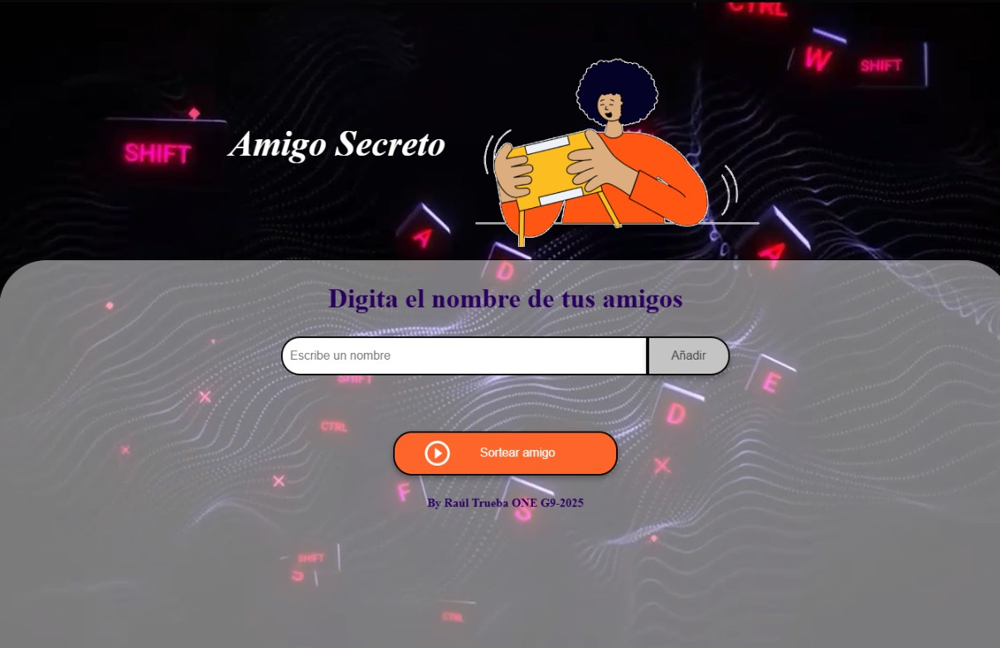

# 🎁 Amigo Secreto – Oracle ONE G9 2025

Proyecto desarrollado como parte del challenge **Oracle ONE G9 2025**, en colaboración con Alura LATAM.  
Una aplicación interactiva y visualmente atractiva para realizar sorteos de **amigo secreto** entre amigos o compañeros.

## 🚀 ¿Cómo funciona?

1. Ingresa los nombres de los participantes.
2. Haz clic en "Añadir" para agregarlos a la lista.
3. Presiona el botón **"Sortear amigo"** y descubre quién es tu amigo secreto.

🎬 La aplicación incluye un video de fondo y una interfaz responsiva para una mejor experiencia de usuario.

## 🛠 Tecnologías utilizadas

- HTML5 + CSS3
- JavaScript (Vanilla)
- Diseño responsivo
- Video background local

## 📁 Archivos importantes

- `index.html`: estructura principal del proyecto.
- `style.css`: estilos personalizados (no incluido en este repositorio).
- `app.js`: lógica para agregar, mostrar y sortear participantes.

## 👨‍💻 Autor

**Raúl Trueba**  
Challenge Oracle ONE G9 - 2025  
By [Alura Latam](https://www.aluracursos.com/)

---

> Proyecto sin frameworks, orientado al aprendizaje de manipulación DOM y buenas prácticas con JS puro.
